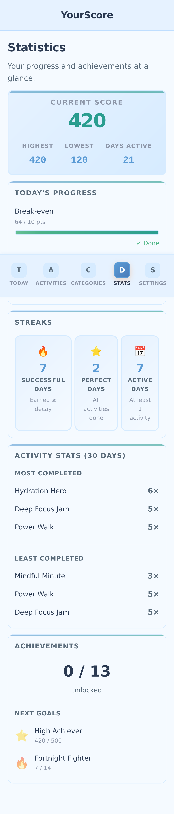

# YourScore

YourScore is a client-only PWA that turns daily habits into points, streaks, and achievements. It runs fully offline and stores everything on your device.

## Why Use It

- **Private by default**: No accounts, no tracking, no server.
- **Offline-first**: Works anywhere once installed.
- **Motivating, not nagging**: Daily decay keeps momentum without guilt.
- **Built for consistency**: Streaks, milestones, and recovery achievements.

## Screenshots




## Live App

Open the hosted version at `https://shuhle.github.io/yourscore/`.

## AI-Assisted Code Notice

This project was coded with AI agents. Please review changes carefully if you plan to reuse or extend the code.

## Features

- Main score that carries across days (positive or negative)
- Daily decay with first-day exemption
- Break-even tracking for today’s points vs. decay
- One completion per activity per day with quick undo
- Categories, analytics, and achievements
- PWA install support

## Install as a PWA

- **Desktop**: Click the install icon in your browser’s address bar
- **Mobile**: Use "Add to Home Screen" from your browser menu

## Quick Start (Development)

```bash
git clone <repository-url>
cd yourscore
npm install
npm run dev
```

The app will be available at `http://localhost:3000`.

## Serve Without Node

You can host the app by serving the `src/` folder directly:

```bash
python3 -m http.server --directory src 3000
```

Then open `http://localhost:3000`. (An HTTP server is required for ES modules and the service worker.)

## Development

```bash
npm run dev          # Start development server
npm test             # Run all tests
npm run test:unit    # Unit tests only
npm run test:e2e     # E2E tests only
npm run test:visual  # Visual regression tests
npm run lint         # Check code style
npm run format       # Format code
```

## License

MIT
